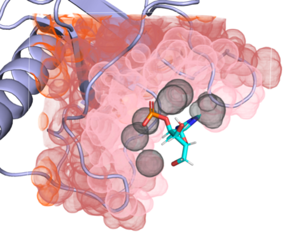

Build your own custom view
---------------------------

We can create custom views with arbritary molecular features. To design our own view, 
we need to create a new class that inherits from `View` and implements the the following methods:

* **get_num_channels()**: Tells how many channels there are.
* **get_channels_names()**: Gives the names of your channels (mostly optional).
* **get_molecular_complex_channels(molecular_complex: MolecularComplex)**: Sets up channels for the whole molecular complex.
* **get_protein_channels(molecular_complex: MolecularComplex)**: Sets up channels just for the protein.
* **get_ligand_channels(molecular_complex: MolecularComplex)**: Sets up channels just for the ligand.

These last three methods make it easier to handle the channels for each part of your complex separately.

The basic idea of each of these methods is to return a boolean matrix with dimensions: 
`n_channels` (how many channels you want) by `n_atoms_complex` (how many atoms are in your protein-ligand complex). 

Each matrix row is a different channel (like one for carbon atoms, one for hydrogen-bond donors, and so on). 
Each column represents an atom in your complex. A spot in the grid tells you if that atom is in the channel or not.

Also, note that the atoms follow the order they appear in the PDB file. The atoms from the protein are listed first, followed by those from the ligand.

Practical example
~~~~~~~~~~~~~~~~~

As an example, let us build a grid where each channel selectively includes protein atoms 
based on their distance from the ligand's center. More specifically, channel :math:`i`  
encompasses protein atoms at a distance :math:`d_a` satisfying the condition 
:math:`x_i \leq d_a < y_i`. Here, :math:`x_i` and :math:`y_i` are the defining 
parameters for distance boundaries.

We define these parameters as:

.. math::

    & (x_0, y_0) = (0, 5) \\
    & (x_1, y_1) = (5, 10) \\
    & (x_2, y_2) = (10, 15) \\
    & (x_3, y_3) = (15, 20)

Let us use a single channel for the ligand that includes every atom. 
So the total number of channels for this representation is 4 + 1 = 5.

.. code-block:: python

    import torch

    from docktgrid.view import View
    from docktgrid.molecule import MolecularComplex

    class CustomView(View):
        """Interface for defining voxel channels representations.

        See View class docs for a more complete documentation.
        """

        def get_num_channels(self):
            """Return number of channels defined for the view."""
            n_channels_complex = 0  # we can skip these since we are not using them
            n_channels_protein = 4
            n_channels_ligand = 1
            return sum((n_channels_complex, n_channels_protein, n_channels_ligand))

        def get_channels_names(self):
            """Return names of channels defined for the view."""
            pass  # this is only useful for visualizations, exporting etc.

        def get_molecular_complex_channels(self, molecular_complex: MolecularComplex):
            """Set of channels considering all atoms of the protein-ligand complex together."""
            return None  # return nothing since we are not using this

        def get_ligand_channels(self, molecular_complex: MolecularComplex):
            """Set of channels considering ligand atoms only."""
            ligand = torch.zeros((1, molecular_complex.n_atoms), dtype=torch.bool)

            # only ligand atoms are true, since this function does not consider
            # protein atoms (which must be set to zero)

            ligand[0][-molecular_complex.n_atoms_ligand :] = True
            return ligand

        def get_protein_channels(self, molecular_complex: MolecularComplex):
            """Set of channels considering protein atoms only."""
            
            # 'protein' is a biopandas object of the protein file, you can see the docs here:
            # https://biopandas.github.io/biopandas/ and do whatever you want with it,
            # even use other libraries to parse the original file
            
            protein = molecular_complex.protein_data.molecule_object
            ligand_center = molecular_complex.ligand_center
            n_atoms_protein = molecular_complex.n_atoms_protein

            distances = [(0, 5), (5, 10), (10, 15), (15, 20)]
            channels = torch.zeros((len(distances), molecular_complex.n_atoms), dtype=torch.bool)
            d = protein.distance(ligand_center)
            
            for i, (x, y) in enumerate(distances):
                channel = ((d >= x) & (d < y)).to_numpy()
                channels[i, :n_atoms_protein] = torch.tensor(channel, dtype=torch.bool)
            
            return channels

.. code-block:: python

    protein_file = "path/to/protein.pdb"
    ligand_file = "path/to/ligand.pdb"
    mol = MolecularComplex(protein_file, ligand_file)

    custom_view = CustomView()
    custom_view(mol).shape

    >>> torch.Size([5, 999])  # final boolean matrix with 5 channels and 'n_atoms_complex' columns

Now we can use this view just as we would use the predefined ones:

.. code-block:: python

    from docktgrid.voxel import VoxelGrid

    voxel = VoxelGrid(
        views=[CustomView()],
        vox_size=1.0,                      
        box_dims=[24.0, 24.0, 24.0], 
    )

    voxel.shape
    >>> (5, 24, 24, 24)

That is it! Below you can see a visualization of the channels we just created. 
Colors represent the different channels with increasing distance boundaries (gray, light pink, dark pink and orange).
Ligand channel is ommited.

